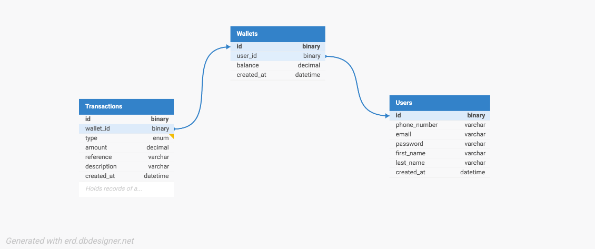

# Demo Credit — Wallet Service

## Overview

Demo Credit is an MVP wallet service built for a mobile lending application. It enables borrowers to receive loans and make repayments through a wallet system. The service exposes a REST API that supports account creation, wallet funding, fund transfers between users, and withdrawals. Users flagged on the Lendsqr Adjutor Karma blacklist are prevented from onboarding.

## Table of Contents

- [Overview](#overview)
- [Tech Stack](#tech-stack)
- [Architecture](#architecture)
- [E-R Diagram](#e-r-diagram)
- [API Documentation](#api-documentation)
- [Key Design Decisions](#key-design-decisions)
- [Assumptions](#assumptions)
- [Setup & Installation](#setup--installation)
- [Environment Variables](#environment-variables)
- [Running Tests](#running-tests)
- [Commit Convention](#commit-convention)

## Tech Stack

| Layer          | Technology             |
| -------------- | ---------------------- |
| Runtime        | Node.js (LTS)          |
| Language       | TypeScript             |
| Framework      | Express.js             |
| ORM            | KnexJS                 |
| Database       | MySQL                  |
| Authentication | JWT (faux token-based) |
| Testing        | Jest + Supertest       |

---

## Architecture

The project follows a **feature-based layered architecture**. Each feature module (user, wallet, transaction) owns its controller, service, routes, and validator. This promotes high cohesion, modularity, and testability without the boilerplate overhead of Clean Architecture — a deliberate tradeoff for an MVP scope.

### Folder Structure

```
src/
  modules/
    user/
      user.controller.ts
      user.service.ts
      user.routes.ts
      user.validator.ts
    wallet/
      wallet.controller.ts
      wallet.service.ts
      wallet.routes.ts
      wallet.validator.ts
    transaction/
      transaction.controller.ts
      transaction.service.ts
      transaction.routes.ts
      transaction.validator.ts
  database/
    migrations/
    knex.ts
  middlewares/
    auth.ts
    error.ts
  utils/
    helpers.ts
    blacklist.ts
  app.ts
  server.ts
tests/
  modules/
    user/
    wallet/
    transaction/
```

**Key separation:**

- `app.ts` — bootstraps Express, registers middlewares and routes
- `server.ts` — starts the HTTP server and database connection
- `controller` — handles HTTP request/response only, no business logic
- `service` — contains all business logic and database interactions

---

## E-R Diagram



### Entity Descriptions

**Users** Stores basic identity information for authentication and identification.

| Column       | Type         | Notes               |
| ------------ | ------------ | ------------------- |
| id           | binary(16)   | Primary key, UUIDv7 |
| first_name   | varchar(100) |                     |
| last_name    | varchar(100) |                     |
| email        | varchar(255) | Unique              |
| phone_number | varchar(20)  | Unique              |
| password     | varchar(255) | Bcrypt hashed       |
| created_at   | datetime     |                     |

**Wallets** Each wallet belongs to one user and is automatically created on registration.

| Column     | Type          | Notes                  |
| ---------- | ------------- | ---------------------- |
| id         | binary(16)    | Primary key, UUIDv7    |
| user_id    | binary(16)    | Foreign key → Users.id |
| balance    | decimal(15,2) | Default 0.00           |
| created_at | datetime      |                        |

**Transactions** Records every money movement. Two records are created per transfer (debit + credit), linked by a shared reference.

| Column      | Type                   | Notes                              |
| ----------- | ---------------------- | ---------------------------------- |
| id          | binary(16)             | Primary key, UUIDv7                |
| wallet_id   | binary(16)             | Foreign key → Wallets.id           |
| type        | enum('credit','debit') |                                    |
| amount      | decimal(15,2)          |                                    |
| reference   | varchar(100)           | Indexed, links paired transactions |
| description | varchar(255)           | Nullable, human-readable context   |
| created_at  | datetime               |                                    |

### Relationships

- **User → Wallet**: One-to-One (wallet created automatically on registration)
- **Wallet → Transactions**: One-to-Many (a wallet has many transaction records)

---

## API Documentation

All endpoints are prefixed with `/api/v1`. Authenticated endpoints require the `Authorization: Bearer <token>` header.

### Authentication

#### Register

```
POST /api/v1/users
```

**Payload:**

```json
{
  "first_name": "John",
  "last_name": "Doe",
  "email": "john@example.com",
  "phone_number": "08012345678",
  "password": "securepassword"
}
```

**Response:** `201 Created` with JWT token

#### Login

```
POST /api/v1/users/login
```

**Payload:**

```json
{
  "email": "john@example.com",
  "password": "securepassword"
}
```

**Response:** `200 OK` with JWT token

---

### Wallet Operations

All wallet endpoints are authenticated.

#### Get Wallet Balance

```
GET /api/v1/wallets/:wallet_id
```

**Response:** `200 OK`

```json
{
  "wallet_id": "...",
  "balance": 5000.0
}
```

#### Fund Wallet

```
POST /api/v1/wallets/:wallet_id/fund
```

**Payload:**

```json
{
  "amount": 5000.0
}
```

**Response:** `200 OK` with updated balance

#### Transfer Funds

```
POST /api/v1/wallets/:wallet_id/transfer
```

**Payload:**

```json
{
  "recipient_email": "jane@example.com",
  "amount": 2000.0,
  "description": "Payment for services"
}
```

**Response:** `200 OK` with updated balance

#### Withdraw Funds

```
POST /api/v1/wallets/:wallet_id/withdraw
```

**Payload:**

```json
{
  "amount": 1000.0
}
```

**Response:** `200 OK` with updated balance

---

### Transaction History

```
GET /api/v1/wallets/:wallet_id/transactions
```

**Response:** `200 OK` with paginated transaction list

---

## Key Design Decisions

### Transaction Scoping

All wallet operations (fund, transfer, withdraw) are wrapped in Knex database transactions. The wallet balance and transaction record must always be in sync — a balance change with no corresponding transaction record is unacceptable in a financial system. If any step fails, the entire operation is rolled back.

### Double-Entry Transaction Records

A transfer between two wallets creates **two transaction records** — one debit on the sender's wallet and one credit on the receiver's wallet. Both records share the same `reference` string, linking them. This makes transaction history auditable and balance reconciliation straightforward.

### Karma Blacklist Check

The Lendsqr Adjutor Karma blacklist is checked **at registration only**, before any user record is created. If a user's email is found on the blacklist, registration is rejected with a vague message to avoid disclosing blacklist status.

### UUID v7 for Primary Keys

UUIDv7 is used for all primary keys. It is time-ordered (sequential), giving better index performance than random UUID v4, while preventing sequential ID enumeration attacks that auto-increment integers are vulnerable to.

---

## Assumptions

1. **Wallet funding** simulates an external payment. In production this would integrate with a provider like Paystack. For this MVP the amount is passed directly in the request payload.
2. **Wallet is automatically created** on user registration. The assessment requirement "create an account" refers to the user account, and a wallet is a mandatory part of onboarding.
3. **Faux authentication** is implemented using JWT. No refresh token mechanism is included.
4. **Blacklisted users** receive a vague rejection: _"We are unable to create an account for you at this time."_ The specific reason (blacklist) is never disclosed to the user.
5. **Minimum wallet balance is zero.** A user cannot withdraw more than their available balance. Negative balances are not permitted.
6. **Transfer recipient** is identified by email address, not internal wallet ID, to reflect real-world UX patterns.
7. **One wallet per user.** The MVP does not support multiple wallets per user.

---

## Setup & Installation

### Prerequisites

- Node.js v22 (LTS)
- MySQL database

### Steps

```bash
# Clone the repository
git clone https://github.com/IEdiong/demo-credit
cd demo-credit

# Install dependencies
yarn install

# Copy environment variables
cp .env.example .env
# Fill in your DB credentials and JWT secret in .env

# Run database migrations
yarn migrate

# Start development server
yarn dev
```

### Environment Variables

```env
PORT=3000
MYSQLHOST=localhost
MYSQLPORT=3306
MYSQLUSER=root
MYSQLPASSWORD=yourpassword
MYSQLDATABASE=demo_credit
JWT_SECRET=yourjwtsecret
ADJUTOR_API_KEY=youradjutorapikey
ADJUTOR_BASE_URL=https://adjutor.lendsqr.com/v2
```

---

## Running Tests

```bash
# Run all tests
yarn test

# Run tests with coverage
yarn test:coverage
```

Tests cover both positive and negative scenarios for all modules including blacklist rejection, insufficient balance, and invalid transfer targets.

---

## Commit Convention

This project follows [Conventional Commits](https://www.conventionalcommits.org/):

```
feat: add wallet funding endpoint
fix: handle insufficient balance on withdrawal
test: add negative scenarios for transfer service
chore: add knex migration for transactions table
```
